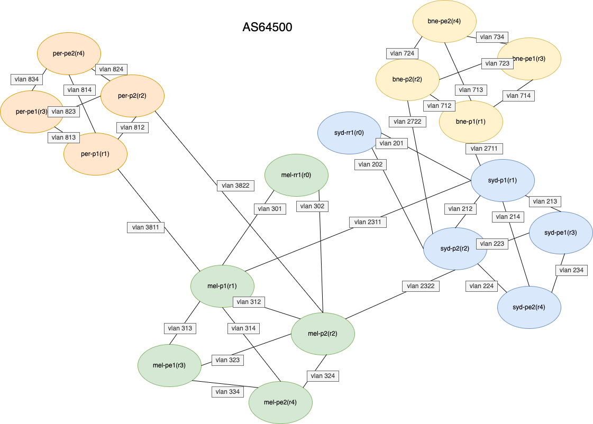
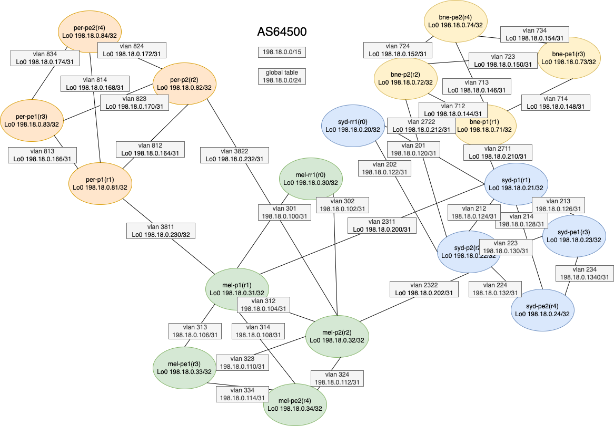

**Task - Design and build as64500 with following requirements**

* build template(gui)
* build hosts and l1/l2 network connectivity from proxmox cli

!!! Note
    This is a note

The diagram shows router names and L2 connectivity

---

The diagram shows L3 information

