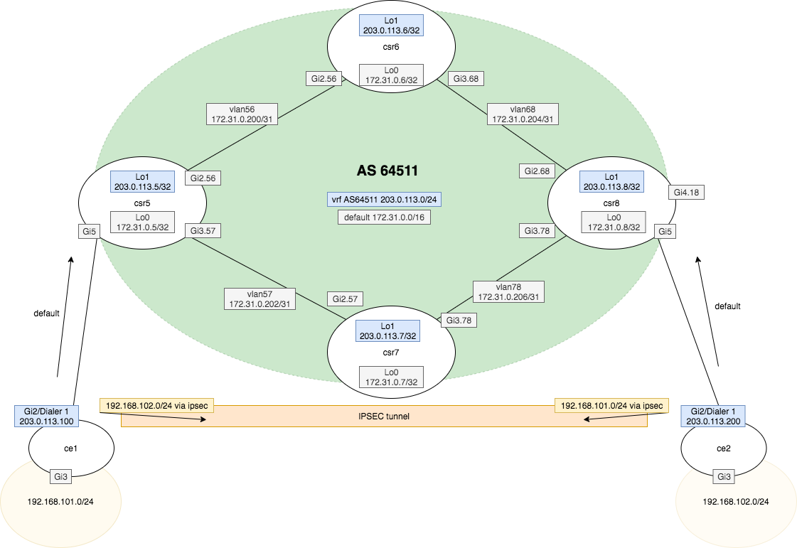

**Task - Create an ipsec tunnel with following properties.**

* ```ce1``` and ```ce2``` are connected to AS64511 via PPPoE
* ```ce1``` and ```ce2``` terminate the ipsec tunnel (there is no NAT-T)
* ```ce1``` and ```ce2``` use SNAT for LAN out to WAN


!!! Note
    Care must be taken to ensure traffic destined for ipsec tunnel is NOT subjected to NAT.


The diagram shows WAN and LAN detail for ```ce1``` and ```ce2```.





=== "ce1"

    ```
    hostname ce1
    !
    crypto isakmp policy 10
     encr aes 192
     hash sha384
     authentication pre-share
     group 14
    crypto isakmp key cisco123 address 203.0.113.200  
    !
    !
    crypto ipsec transform-set TSET esp-aes 256 esp-sha512-hmac 
     mode tunnel
    !
    !
    !
    crypto map CMAP 10 ipsec-isakmp 
     set peer 203.0.113.200
     set transform-set TSET 
     match address 100
    !
    interface GigabitEthernet2
     no ip address
     negotiation auto
     pppoe enable group global
     pppoe-client dial-pool-number 1
     no mop enabled
     no mop sysid
    !
    interface GigabitEthernet3
     ip address 192.168.101.1 255.255.255.0
     ip nat inside
     negotiation auto
     no mop enabled
     no mop sysid
    !
    interface Dialer1
     ip address negotiated
     ip nat outside
     encapsulation ppp
     ip tcp adjust-mss 1452
     dialer pool 1
     ppp authentication chap callin
     ppp chap hostname ppp1@inband.dev
     ppp chap password 0 pass1
     ppp ipcp route default
     crypto map CMAP
    !
    ip nat inside source list 101 interface Dialer1 overload
    !
    access-list 100 permit ip 192.168.101.0 0.0.0.255 192.168.102.0 0.0.0.255
    access-list 101 deny   ip 192.168.101.0 0.0.0.255 192.168.102.0 0.0.0.255
    access-list 101 permit ip 192.168.101.0 0.0.0.255 any
    
    ```

=== "ce2"

    ```
    hostname ce2
    !
    crypto isakmp policy 10
     encr aes 192
     hash sha384
     authentication pre-share
     group 14
    crypto isakmp key cisco123 address 203.0.113.100  
    !
    !
    crypto ipsec transform-set TSET esp-aes 256 esp-sha512-hmac 
     mode tunnel
    !
    !
    !
    crypto map CMAP 10 ipsec-isakmp 
     set peer 203.0.113.100
     set transform-set TSET 
     match address 100
    !
    !
    !
    interface GigabitEthernet2
     no ip address
     negotiation auto
     pppoe enable group global
     pppoe-client dial-pool-number 1
     no mop enabled
     no mop sysid
    !
    interface GigabitEthernet3
     ip address 192.168.102.1 255.255.255.0
     ip nat inside
     negotiation auto
     no mop enabled
     no mop sysid
    !
    interface Dialer1
     ip address negotiated
     ip nat outside
     encapsulation ppp
     ip tcp adjust-mss 1452
     dialer pool 1
     ppp authentication chap callin
     ppp chap hostname ppp2@inband.dev
     ppp chap password 0 pass2
     ppp ipcp route default
     crypto map CMAP
    !
    ip nat inside source list 102 interface Dialer1 overload
    !
    access-list 100 permit ip 192.168.102.0 0.0.0.255 192.168.101.0 0.0.0.255
    access-list 102 deny   ip 192.168.102.0 0.0.0.255 192.168.101.0 0.0.0.255
    access-list 102 permit ip 192.168.102.0 0.0.0.255 any
    
    ```

**Verification**

Ping ```ce2``` LAN from ```ce1``` LAN will running debug on ```ce2```

```ce1```

```
ce1#ping 192.168.102.1 source GigabitEthernet 3
Type escape sequence to abort.
Sending 5, 100-byte ICMP Echos to 192.168.102.1, timeout is 2 seconds:
Packet sent with a source address of 192.168.101.1 
.!!!!
Success rate is 80 percent (4/5), round-trip min/avg/max = 1/2/3 ms
```


```ce2```

```
ce2#show debug | inc Crypto
Cryptographic Subsystem:
  Crypto ISAKMP debugging is on
  Crypto IPSEC debugging is on
```

debug ouput

```
ce2#
*Feb 23 00:19:54.625: ISAKMP-PAK: (1001):received packet from 203.0.113.100 dport 500 sport 500 Global (R) QM_IDLE      
*Feb 23 00:19:54.625: ISAKMP: (1001):set new node 3329780046 to QM_IDLE      
*Feb 23 00:19:54.625: ISAKMP: (1001):processing HASH payload. message ID = 3329780046
*Feb 23 00:19:54.625: ISAKMP: (1001):processing SA payload. message ID = 3329780046
*Feb 23 00:19:54.625: ISAKMP: (1001):Checking IPSec proposal 1
*Feb 23 00:19:54.625: ISAKMP: (1001):transform 1, ESP_AES 
*Feb 23 00:19:54.625: ISAKMP: (1001):   attributes in transform:
*Feb 23 00:19:54.626: ISAKMP: (1001):      encaps is 1 (Tunnel)
*Feb 23 00:19:54.626: ISAKMP: (1001):      SA life type in seconds
*Feb 23 00:19:54.626: ISAKMP: (1001):      SA life duration (basic) of 3600
*Feb 23 00:19:54.626: ISAKMP: (1001):      SA life type in kilobytes
*Feb 23 00:19:54.626: ISAKMP:      SA life duration (VPI) of  0x0 0x46 0x50 0x0 
*Feb 23 00:19:54.626: ISAKMP: (1001):      authenticator is HMAC-SHA512
*Feb 23 00:19:54.626: ISAKMP: (1001):      key length is 256
*Feb 23 00:19:54.626: ISAKMP: (1001):atts are acceptable.
*Feb 23 00:19:54.626: IPSEC(validate_proposal_request): proposal part #1
*Feb 23 00:19:54.626: IPSEC(validate_proposal_request): proposal part #1,
  (key eng. msg.) INBOUND local= 203.0.113.200:0, remote= 203.0.113.100:0,
    local_proxy= 192.168.102.0/255.255.255.0/256/0,
    remote_proxy= 192.168.101.0/255.255.255.0/256/0,
    protocol= ESP, transform= esp-aes 256 esp-sha512-hmac  (Tunnel), 
    lifedur= 0s and 0kb, 
    spi= 0x0(0), conn_id= 0, keysize= 256, flags= 0x0
*Feb 23 00:19:54.627: Crypto mapdb : proxy_match
        src addr     : 192.168.102.0
        dst addr     : 192.168.101.0
        protocol     : 0
        src port     : 0
        dst port     : 0
*Feb 23 00:19:54.627: (ipsec_process_proposal)Map Accepted: CMAP, 10
*Feb 23 00:19:54.627: ISAKMP: (1001):processing NONCE payload. message ID = 3329780046
*Feb 23 00:19:54.627: ISAKMP: (1001):processing ID payload. message ID = 3329780046
*Feb 23 00:19:54.627: ISAKMP: (1001):processing ID payload. message ID = 3329780046
*Feb 23 00:19:54.627: ISAKMP: (1001):QM Responder gets spi
*Feb 23 00:19:54.628: ISAKMP: (1001):Node 3329780046, Input = IKE_MESG_FROM_PEER, IKE_QM_EXCH
*Feb 23 00:19:54.628: ISAKMP: (1001):Old State = IKE_QM_READY  New State = IKE_QM_SPI_STARVE
*Feb 23 00:19:54.628: ISAKMP: (1001):Node 3329780046, Input = IKE_MESG_INTERNAL, IKE_GOT_SPI
*Feb 23 00:19:54.628: ISAKMP: (1001):Old State = IKE_QM_SPI_STARVE  New State = IKE_QM_IPSEC_INSTALL_AWAIT
*Feb 23 00:19:54.628: IPSEC(key_engine): got a queue event with 1 KMI message(s)
*Feb 23 00:19:54.628: Crypto mapdb : proxy_match
        src addr     : 192.168.102.0
        dst addr     : 192.168.101.0
        protocol     : 256
        src port     : 0
        dst port     : 0
*Feb 23 00:19:54.628: IPSEC(crypto_ipsec_create_ipsec_sas): Map found CMAP, 10
*Feb 23 00:19:54.629: IPSEC(get_old_outbound_sa_for_peer): No outbound SA found for peer 7F9E85D63050
*Feb 23 00:19:54.629: IPSEC(create_sa): sa created,
  (sa) sa_dest= 203.0.113.200, sa_proto= 50, 
    sa_spi= 0x63A278D7(1671592151), 
    sa_trans= esp-aes 256 esp-sha512-hmac , sa_conn_id= 2005
    sa_lifetime(k/sec)= (4608000/3600),
  (identity) local= 203.0.113.200:0, remote= 203.0.113.100:0,
    local_proxy= 192.168.102.0/255.255.255.0/256/0,
    remote_proxy= 192.168.101.0/255.255.255.0/256/0
*Feb 23 00:19:54.629: IPSEC(create_sa): sa created,
  (sa) sa_dest= 203.0.113.100, sa_proto= 50, 
    sa_spi= 0x731256EB(1930581739), 
    sa_trans= esp-aes 256 esp-sha512-hmac , sa_conn_id= 2006
    sa_lifetime(k/sec)= (4608000/3600),
  (identity) local= 203.0.113.200:0, remote= 203.0.113.100:0,
    local_proxy= 192.168.102.0/255.255.255.0/256/0,
    remote_proxy= 192.168.101.0/255.255.255.0/256/0
*Feb 23 00:19:54.703: ISAKMP-ERROR: (0):Failed to find peer index node to update peer_info_list
*Feb 23 00:19:54.703: ISAKMP: (1001):Received IPSec Install callback... proceeding with the negotiation
*Feb 23 00:19:54.703: ISAKMP: (1001):Successfully installed IPSEC SA (SPI:0x63A278D7) on Dialer1
*Feb 23 00:19:54.703: ISAKMP-PAK: (1001):sending packet to 203.0.113.100 my_port 500 peer_port 500 (R) QM_IDLE      
*Feb 23 00:19:54.703: ISAKMP: (1001):Sending an IKE IPv4 Packet.
*Feb 23 00:19:54.704: ISAKMP: (1001):Node 3329780046, Input = IKE_MESG_FROM_IPSEC, IPSEC_INSTALL_DONE
*Feb 23 00:19:54.704: ISAKMP: (1001):Old State = IKE_QM_IPSEC_INSTALL_AWAIT  New State = IKE_QM_R_QM2
*Feb 23 00:19:54.951: ISAKMP-PAK: (1001):received packet from 203.0.113.100 dport 500 sport 500 Global (R) QM_IDLE      
*Feb 23 00:19:54.951: ISAKMP: (1001):deleting node 3329780046 error FALSE reason "QM done (await)"
*Feb 23 00:19:54.951: ISAKMP: (1001):Node 3329780046, Input = IKE_MESG_FROM_PEER, IKE_QM_EXCH
*Feb 23 00:19:54.951: ISAKMP: (1001):Old State = IKE_QM_R_QM2  New State = IKE_QM_PHASE2_COMPLETE
*Feb 23 00:19:54.951: IPSEC(key_engine): got a queue event with 1 KMI message(s)
*Feb 23 00:19:54.951: IPSEC(key_engine_enable_outbound): rec'd enable notify from ISAKMP
```

