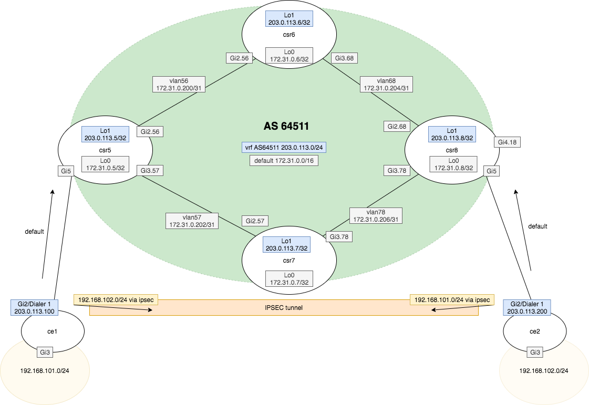

**Task - Create an ipsec tunnel with following properties.**

* ```ce1``` and ```ce2``` are connected to AS64511 via PPPoE
* ```ce1``` and ```ce2``` terminate the ipsec tunnel (there is no NAT-T)
* ```ce1``` and ```ce2``` use SNAT for LAN out to WAN


!!! Note
    Care must be taken to ensure traffic destined for ipsec tunnel is NOT subjected to NAT.


The diagram shows WAN and LAN detail for ```ce1``` and ```ce2```.





=== "ce1"

    ```
    hostname ce1
    !
    crypto isakmp policy 10
     encr aes 192
     hash sha384
     authentication pre-share
     group 14
    crypto isakmp key cisco123 address 203.0.113.200  
    !
    !
    crypto ipsec transform-set TSET esp-aes 256 esp-sha512-hmac 
     mode tunnel
    !
    !
    !
    crypto map CMAP 10 ipsec-isakmp 
     set peer 203.0.113.200
     set transform-set TSET 
     match address 100
    !
    interface GigabitEthernet2
     no ip address
     negotiation auto
     pppoe enable group global
     pppoe-client dial-pool-number 1
     no mop enabled
     no mop sysid
    !
    interface GigabitEthernet3
     ip address 192.168.101.1 255.255.255.0
     ip nat inside
     negotiation auto
     no mop enabled
     no mop sysid
    !
    interface Dialer1
     ip address negotiated
     ip nat outside
     encapsulation ppp
     ip tcp adjust-mss 1452
     dialer pool 1
     ppp authentication chap callin
     ppp chap hostname ppp1@inband.dev
     ppp chap password 0 pass1
     ppp ipcp route default
     crypto map CMAP
    !
    ip nat inside source list 101 interface Dialer1 overload
    !
    access-list 100 permit ip 192.168.101.0 0.0.0.255 192.168.102.0 0.0.0.255
    access-list 101 deny   ip 192.168.101.0 0.0.0.255 192.168.102.0 0.0.0.255
    access-list 101 permit ip 192.168.101.0 0.0.0.255 any
    
    ```

=== "ce2"

    ```
    hostname ce2
    !
    crypto isakmp policy 10
     encr aes 192
     hash sha384
     authentication pre-share
     group 14
    crypto isakmp key cisco123 address 203.0.113.100  
    !
    !
    crypto ipsec transform-set TSET esp-aes 256 esp-sha512-hmac 
     mode tunnel
    !
    !
    !
    crypto map CMAP 10 ipsec-isakmp 
     set peer 203.0.113.100
     set transform-set TSET 
     match address 100
    !
    !
    !
    interface GigabitEthernet2
     no ip address
     negotiation auto
     pppoe enable group global
     pppoe-client dial-pool-number 1
     no mop enabled
     no mop sysid
    !
    interface GigabitEthernet3
     ip address 192.168.102.1 255.255.255.0
     ip nat inside
     negotiation auto
     no mop enabled
     no mop sysid
    !
    interface Dialer1
     ip address negotiated
     ip nat outside
     encapsulation ppp
     ip tcp adjust-mss 1452
     dialer pool 1
     ppp authentication chap callin
     ppp chap hostname ppp2@inband.dev
     ppp chap password 0 pass2
     ppp ipcp route default
     crypto map CMAP
    !
    ip nat inside source list 102 interface Dialer1 overload
    !
    access-list 100 permit ip 192.168.102.0 0.0.0.255 192.168.101.0 0.0.0.255
    access-list 102 deny   ip 192.168.102.0 0.0.0.255 192.168.101.0 0.0.0.255
    access-list 102 permit ip 192.168.102.0 0.0.0.255 any
    
    ```
